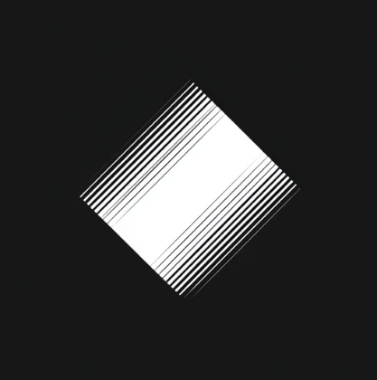
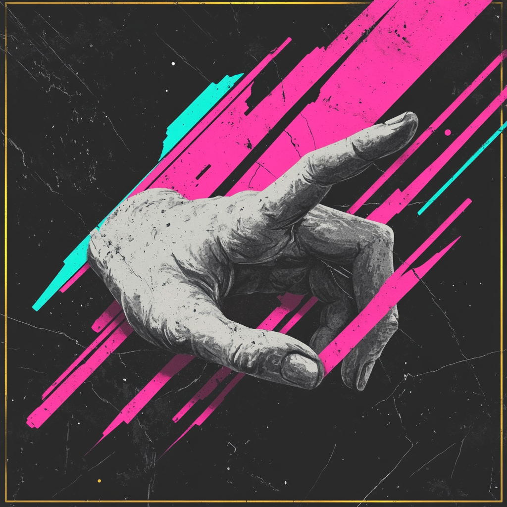

  

---

### 🐛 GlitchSnap Studio — QA All-in-One Desktop Tool

 

> **QA 브라우저 환경 테스트 및 테스트케이스, 통계 관리 데스크톱 앱**
>
> 브라우저 녹화(rrweb) · 스크린샷 · 환경정보 자동 수집 · TC 엑셀 관리

 

 

  

 

&nbsp;

  

---

### 🔗 다시보기 [Dasibogi] — AI Link Organizer

 

> **URL을 던지면, AI가 알아서 분류하고 정리해주는 데스크톱 트레이 앱**
>
> 단축키 하나로 클립보드의 링크를 자동 분석 · 태그 생성 · 카테고리 분류

 

 

  

 

  
  &nbsp;
  
  &nbsp;
  

  

---

### 📂 copyNpaste — Project Folder Sync Tool

 

> **SI 환경에서 회사 ↔ 고객사 프로젝트 폴더를 안전하게 동기화하는 데스크톱 앱**
>
> 변경 파일 감지 · Git 이력 조회 · 인프라 파일 경고 · 선택적 덮어쓰기

 

 

  

 

  

  

 ---

### 🖥️  SSH-GUI — Mac Mini Remote File Manager

 

> **Tailscale + SSH로 원격 맥미니의 파일을 GUI로 관리하는 데스크톱 앱**
>
> 파일 탐색기 · SFTP 업로드/다운로드 · 드래그 앤 드롭 · 검색 · 시스템
  상태

 

 

  

 

  

### ✨ Tech Stacks

 

**Frontend**

**Mobile & Desktop**

**Backend**

**Game**

  

---

### 🛠️  Tools

 

  

---

### 💬 Contact

 

  

